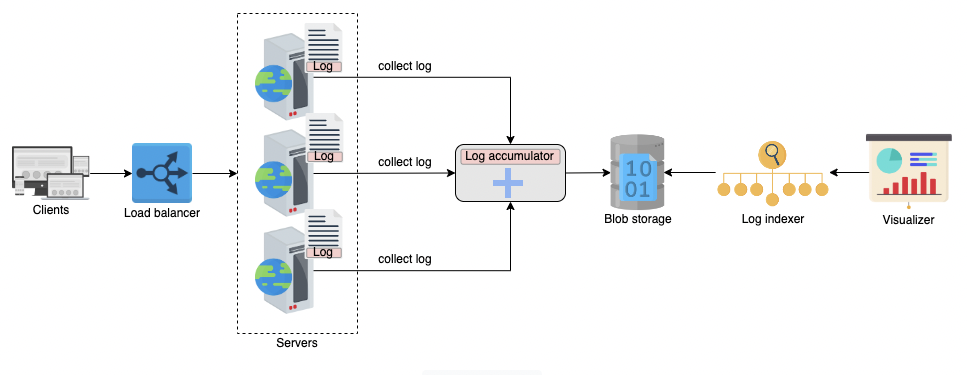

# Basic System Design

## Domain Name System

## Proxy

## Load Balancer

## Database

## Key-Value Store

## Content Delivery Network

## Sequencer

## Distributed Monitoring

## Monitoring Server-side Errors

## Distributed Client-side Errors

## Distributed Cache

## Distributed Messaging Queue

## Pub-sub

## Rate Limiter

## Blob Store

## Distributed Search

## Distributed Logging

[Distributed Logging](basic/distributed_logging.md)

## Distributed Task Scheduler

## Sharded Counters

## Top K Problem

# Intermediate System Design

# Advanced System Design

