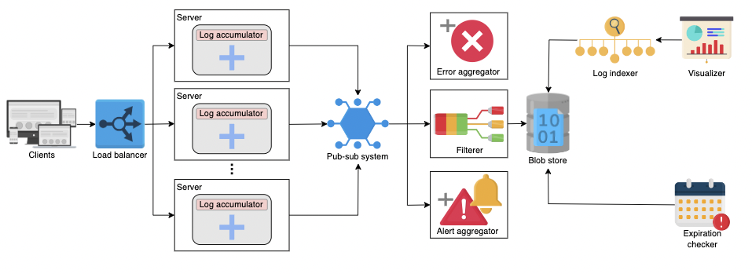

# To-Do List

- [ ] [Facebook System Design Interview: Design an Analytics Platform (Metrics & Logging)](https://www.youtube.com/watch?v=kIcq1_pBQSY)
- [ ] [Distributed Metrics/Logging Design Deep Dive with Google SWE! | Systems Design Interview Question 14](https://www.youtube.com/watch?v=_KoiMoZZ3C8)

# Logging

- A log file records details of events occurring in a software application.
- The details may consist of microservices, transactions, service actions, etc. to debug the flow of an event in the system.

 

- Use cases
  - Understand the flow of an event in a distributed system.
  - Monitor the health of an application using alert and error aggregators.
  - Pinpoint when and how a system failed or was compromised and find out the root cause of the failure or breach.
  - Decrease the meantime to repair a system.

## Restrain the log size

- Problem
  - The number of logs increases over time.
  - At a time hundreds of concurrent messages need to be logged.
  - But not all are important enough to be logged.
Solution
- Structure logs to help decide what to log into the system on the application or logging level.

### Use sampling

- Scenario where the sampling approach works:
  - e.g. large systems like Facebook where billions of events happen per second
  - e.g. situation where we have lots of messages from the same set of events
  - e.g. people commenting on a post, where Person X commented on Person Y’s post, then Person Z commented on Person Y’s post, etc.
  - Use a sampler service (with a sampling threshold and strategy) that logs only a smaller and representative set of messages from a larger chunk.
  - Categorize the types of messages and apply a filter that identifies the important messages and logs only those messages to the system.

 

- Scenario where the sampling approach does not work:
  - e.g. application that processes a financial ATM transaction and runs services like fraud detection, expiration time checking, card validation, etc.
  - If logging of any service is missed out, end-to-end flow of events cannot be identified when debugging errors.

### Use categorization

- Severity levels used in logging: DEBUG, INFO, WARNING, ERROR, FATAL/CRITICAL.
- Production logs are set to print messages with the severity of WARNING and above.
- For more detailed flow, severity levels can be set to DEBUG and INFO levels.

## Structure the logs

- Applications have the liberty to choose the structure of their log data.
- For example, an application is free to write to log as binary or text data, but it is often helpful to enforce some structure on the logs.
- Benefits of structured logs:
  - better interoperability between log writers and readers
  - make the job of a log processing system easier

 

- [PhD thesis by Ryan Braud titled "Query-based debugging of distributed systems."](https://escholarship.org/uc/item/2p06d5sv)

## Points to consider while logging

- For secure data log encrypted data.
- Avoid logging personally identifiable information (PII), such as names, addresses, emails, and so on.
- Avoid logging sensitive information like credit card numbers, passwords, and so on.
- Avoid excessive information. Logging all information is unnecessary and only takes up more space and affects performance (logging is an I/O-heavy operation).
- The logging mechanism should be secure and not vulnerable because logs contain the application’s flow, and an insecure logging mechanism is vulnerable to hackers.

### Vulnerability in logging infrastructure

- A zero-day vulnerability in Log4j, a famous logging framework for Java, has been identified as of November 2021.
- Log4j has contained the hidden vulnerability, Log4Shell (CVE-2021-44228), since 2013.
- Apache gave the highest available score, a CVSS severity rating of 10, to Log4Shell. 
- The exploit is simple to execute and affects hundreds of millions of devices.
- This vulnerability can allow devastating cyberattacks because it can enable attackers to run malicious code and take control of the machine.

# Design of a Distributed Logging Service

## Requirements

### Functional requirements

- Writing logs: The services of the distributed system should be able to write events into the logging system.
- Storing logging: The logs should reside in distributed storage for easy access.
- Searchable logs: The system should be able to search for logs and the flow of events from end-to-end.
- Centralized logging visualizer: The system should provide a unified view of globally separated services.

 

- System should log all activities or messages (without incorporating sampling ability)

### Non-functional requirements

- Low latency: Logging is an I/O-intensive operation and much slower than CPU operations. Logging should not be on an application’s critical path.
- Scalability: The logging system should be able to handle an increasing amount of logs and a growing number of concurrent users.
- Availability: The logging system should be highly available to log events.

## API design

- Write a message
  - _write(unique_ID, message_to_be_logged)_
  - _unique_ID_ is a numeric ID containing _application-id_, _service-id_, and a time stamp.
  - _message_to_be_logged_ is the log message stored against a unique key.

- Search log
  - _searching(keyword)_
  - _keyword_ is used for finding logs containing the keyword.

## Initial design

- In a distributed system clients across the globe generate events by requesting services from different serving nodes.
- The nodes generate logs while handling each of the requests.
- These logs are accumulated on the respective nodes.

 

Major components of the system:
- Log accumulator to collect logs from each node and dump them into storage so that we do not need to visit individual nodes to know about a particular event
- Blob storage to save the logs after accumulation
- Pub-sub system to handle the huge size of logs
- Log indexer to use distributed search to query the growing number of log files efficiently
- Visualizer to provide a unified view of all the logs

There are millions of servers in a distributed system, and using a single log accumulator severely affects scalability.
Let’s learn how we’ll scale our system.

## Logging at various levels

### In a server

In this section, we’ll learn how various services belonging to different apps will log in to a server.

Let’s consider a situation where we have multiple different applications on a server, such as App 1, App 2, and so on.
Each application has various microservices running as well.
For example, an e-commerce application can have services like authenticating users, fetching carts, and more running at the same time.
Every service produces logs.
We use an ID with `application-id`, `service-id`, and its time stamp to uniquely identify various services of multiple applications.
Time stamps can help us to determine the causality of events.

Each service will push its data to the log accumulator service.
It is responsible for these actions:
- Receiving the logs.
- Storing the logs locally.
- Pushing the logs to a pub-sub system.

We use the pub-sub system to cater to our scalability issue.
Now, each server has its log accumulator (or multiple accumulators) push the data to pub-sub.
The pub-sub system is capable of managing a huge amount of logs.

To fulfill another requirement of low latency, we don’t want the logging to affect the performance of other processes, so we send the logs asynchronously via a low-priority thread.
By doing this, our system does not interfere with the performance of others and ensures availability.

- Multiple applications running on a server, and each application has various microservices
- Each service produces logs and sends them to the log accumulator
- Log accumulator pushes logs to a pub-sub system

We should be mindful that data can be lost in the process of logging huge amounts of messages.
There is a trade-off between user-perceived latency and the guarantee that log data persists.
For lower latency, log services often keep data in RAM and persist them asynchronously.
Additionally, we can minimize data loss by adding redundant log accumulators to handle growing concurrent users.

How does logging change when we host our service on a multi-tenant cloud (like AWS) versus when an organization has exclusive control of the infrastructure (like Facebook), specifically in terms of logs?

Security might be one aspect that differs between multi-tenant and single-tenant settings.
When we encrypt all logs and secure a logging service end-to-end, it does not come free, and has performance penalties.
Additionally, strict separation of logs is required for a multi-tenant setting, while we can improve the storage and processing utilization for a single-tenant setting.

Let’s take the example of Meta’s Facebook.
They have millions of machines that generate logs, and the size of the logs can be several petabytes per hour.
So, each machine pushes its logs to a pub-sub system named Scribe.
Scribe retains data for a few days and various other systems process the information residing in the Scribe.
They store the logs in distributed storage also.
Managing the logs can be application-specific.

On the other hand, for multi-tenancy, we need a separate instance of pub-sub per tenant (or per application) for strict separation of logs.

Note: For applications like banking and financial apps, the logs must be very secure so hackers cannot steal the data.
The common practice is to encrypt the data and log.
In this way, no one can decrypt the encrypted information using the data from logs.

### At datacenter level

All servers in a data center push the logs to a pub-sub system.
Since we use a horizontally-scalable pub-sub system, it is possible to manage huge amounts of logs.
We may use multiple instances of the pub-sub per data center.
It makes our system scalable, and we can avoid bottlenecks.
Then, the pub-sub system pushes the data to the blob storage.

The data does not reside in pub-sub forever and gets deleted after a few days before being stored in archival storage.
However, we can utilize the data while it is available in the pub-sub system.
The following services will work on the pub-sub data:
- Filterer: It identifies the application and stores the logs in the blob storage reserved for that application since we do not want to mix logs of two different applications.
- Error aggregator: It is critical to identify an error as quickly as possible. We use a service that picks up the error messages from the pub-sub system and informs the respective client. It saves us the trouble of searching the logs.
- Alert aggregator: Alerts are also crucial. So, it is important to be aware of them early. This service identifies the alerts and notifies the appropriate stakeholders if a fatal error is encountered, or sends a message to a monitoring tool.

Do we store the logs for a lifetime?
Logs also have an expiration date. We can delete regular logs after a few days or months.
Compliance logs are usually stored for up to three to five years.
It depends on the requirements of the application.

In our design, we have identified another component called the expiration checker.
It is responsible for these tasks:
- Verifying the logs that have to be deleted. Verifying the logs to store in cold storage. (Cold storages are low-cost storages where archived data is kept. It is done to save money on storage charges and to migrate data that isn’t used frequently.)
Moreover, our components log indexer and visualizer work on the blob storage to provide a good searching experience to the end user.
We can see the final design of the logging service below:

We learned earlier that a simple user-level API call to a large service might involve hundreds of internal microservices and thousands of nodes.
How can we stitch together logs end-to-end for one request with causality intact?

Most complex services use a front-end server to handle an end user’s request.
On reception of a request, the front-end server can get a unique identifier using a sequencer.
This unique identifier will be appended to all the fanned-out services.
Each log message generated anywhere in the system also emits the unique identifier.

Later, we can filter the log (or preprocess it) based on the unique identifiers.
At this step, we are able to collect all the logs across microservices against a unique request.
In the Sequencer building block, we discussed that we can get unique identifiers that maintain happens-before causality.
Such an identifier has the property that if ID 1 is less than ID 2, then ID 1 represents a time that occurred before ID 2.
Now, each log item can use a time- stamp, and we can sort log entries for a specific request in ascending order.

Correctly ordering the log in a chronological (or causal) order simplifies log analyses.

Windows Azure Storage System (WAS) uses an extensive logging infrastructure in its development.
It stores the logs in local disks, and given a large number of logs, they do not push the logs to the distributed storage.
Instead, they use a grep-like utility that works as a distributed search.
This way, they have a unified view of globally distributed logs data.

There can be various ways to design a distributed logging service, but it solely depends on the requirements of our application.
