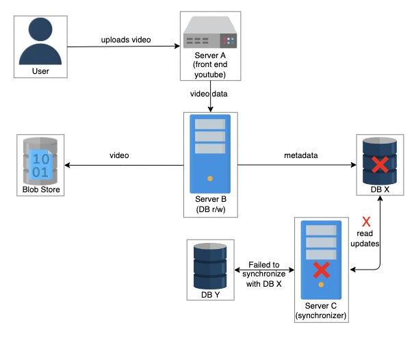
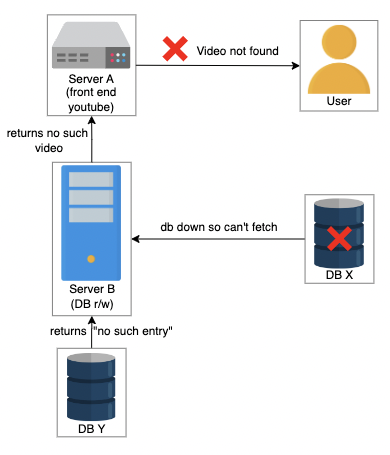
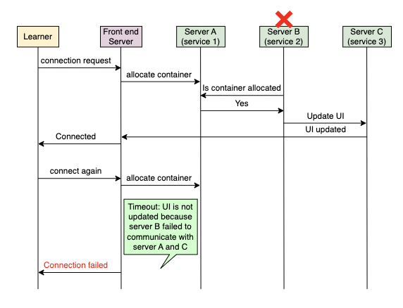

# Table of Contents

1. [Distributed Monitoring](#distributed-monitoring)
2. [Need for Monitoring](#need-for-monitoring)
   - [Downtime Cost](#downtime-cost)
3. [Types of Monitoring](#types-of-monitoring)
   - [Server-side Errors](#server-side-errors)
   - [Client-side Errors](#client-side-errors)
4. [Prerequisites of a Monitoring System](#prerequisites-of-a-monitoring-system)
   - [Monitoring: Metrics and Alerting](#monitoring-metrics-and-alerting)
   - [Metrics](#metrics)
     - [Populate the Metrics](#populate-the-metrics)
     - [Persist the Data](#persist-the-data)
     - [Application Metrics](#application-metrics)
   - [Alerting](#alerting)

# Distributed Monitoring

- The modern economy depends on the continual operation of IT infrastructure.
- Such infrastructure contains hardware, distributed services, and network resources.
- These components are interlinked in such infrastructure, making it challenging to keep everything functioning smoothly and without application downtime.

 

- It’s challenging to know what’s happening at the hardware or application level when our infrastructure is distributed across multiple locations and includes many servers.
- Components can run into failures, response latency overshoot, overloaded or unreachable hardware, and containers running out of resources, among others.
- Multiple services are running in such an infrastructure, and anything can go awry.

 

- When one of the services goes down, it can be the reason for other services to crash, and as a result, the application is unavailable to users.
- If we don’t know what went wrong early, it could take us a lot of time and effort to debug the system manually.
- Moreover, for larger services, we need to ensure that our services are working within our agreed service-level agreements.
- We need to catch important trends and signals of impending failures as early warnings so that any concerns or issues can be addressed.

 

- Monitoring helps in analyzing such complex infrastructure where something is constantly failing.
- Monitoring distributed systems entails gathering, interpreting, and displaying data about the interactions between processes that are running at the same time.
- It assists in debugging, testing, performance evaluation, and having a bird’s-eye view over multiple services.

# Need for Monitoring

- The failure of a single service can affect the smooth execution of related systems.
- To avoid cascading failures, monitoring can play a vital role with early warnings or steering us to the root cause of faults.

 

- Let’s consider a scenario where a user uploads a video, intro-to-system-design, to YouTube.
- The UI service in server A takes the video information and gives the data to service 2 in server B.
- Service 2 makes an entry in the database and stores the video in blob storage.
- Another service, 3, in server C manages the replication and synchronization of databases X and Y.

 

- In this scenario, service 3 fails due to some error, and service 2 makes an entry in the database X.
- The database X crashes, and database Y doesn’t have an entry of the intro-to-system-design video.

 

 

- The user requests to fetch the video.
- The UI service in server A forwards the read request to Server B.
- The database X crashes.
- The video cannot be fetched as database is down.
- The request is forwarded to database Y.
- The database Y does not have any entry of this video.
- The response of "Video not found" is returned to the UI server.
- The response of "Video not found" is returned to the user.

 

 

- The example above is relatively simple.
- In reality, complex problems are encountered since we have many data centers across the globe, and each has millions of servers.
- Due to a decreasing human administrators to servers ratio, it’s often not feasible to manually find the problems.
- Having a monitoring system reduces operational costs and encourages an automated way to detect failures.

## Downtime Cost

- There are fault-tolerant system designs that hide most of the failures from the end users, but it’s crucial to catch the failures before they snowball into a bigger problem.
- The unplanned outage in services can be costly.
- For example, in October 2021, Meta’s applications were down for nearly nine hours, resulting in a loss of around $13 million per hour.
- Such losses emphasize the potential impact of outages.

 

- The IT infrastructure is spread widely around the globe.
- The distributed data centers of major cloud providers across the globe are connected through private or public networks.
- Monitoring the servers in geo-separated data centers is essential.

 

- According to Amazon, on December 7, 2021,
- "At 7:30 AM PST, an automated activity to scale capacity of one of the AWS services hosted in the main AWS network triggered an unexpected behavior from a large number of clients inside the internal network.
- This resulted in a large surge of connection activity that overwhelmed the networking devices between the internal network and the main AWS network, resulting in communication delays between these networks.
- These delays increased latency and errors for services communicating between these networks, resulting in even more connection attempts and retries.
- This led to persistent congestion and performance issues on the devices connecting the two networks."
- According to one estimate, the outage cost of Amazon was $66,240 per minute.

# Types of Monitoring

## Server-side Errors

- These are errors that are usually visible to monitoring services as they occur on servers.
- Such errors are reported as error 5xx in HTTP response codes.

 

- At Educative, whenever a learner connects to an executable environment, a container is assigned.
- Consider service 1 in server A, which is responsible for allocating a container whenever a learner connects.
- Another service 2 on server B takes this information and informs the service responsible for UI.
- The UI service running in server C updates the UI for the learner.
- Let’s assume that service 2 fails because of some error, and the learner sees the error of “Cannot connect…”
- How do the Educative developers find out that a learner is facing this error?

 

- The learner initiates a connection request to Educative
- Educative's front-end server initiates allocate container request
- Service 2 in server B allocates a container and informs service 1 in server A
- Service 1 in server A acknowledges the allocation
- Service 3 in server C receives the request to update the UI for the learner
- Service 3 in server C updates the UI for the learner
- The connection is established for the learner
- The learner initiates a connection request to Educative again
- Educative's front-end server initiates the request to allocate the container
- Server B fails due to some reason
- The front-end server waits for the learner’s UI to be updated
- The request times out
- The connection for the learner could not be established
- How will the developers know about the connection failed error?

 

## Client-side Errors

- These are errors whose root cause is on the client-side.
- Such errors are reported as error 4xx in HTTP response codes.
- Some client-side errors are invisible to the service when client requests fail to reach the service.

 

- What if a learner makes a request and it never reaches the servers of Educative.
- How will Educative know that a learner is facing an issue?

# Prerequisites of a Monitoring System

## Monitoring: Metrics and Alerting

- A good monitoring system needs to clearly define what to measure and in what units (metrics).
- The monitoring system also needs to define threshold values of all metrics and the ability to inform appropriate stakeholders (alerts) when values are out of acceptable ranges.
- Knowing the state of our infrastructure and systems ensures service stability.
- The support team can respond to issues more quickly and confidently if they have access to information on the health and performance of the deployments.
- Monitoring systems that collect measurements, show data, and send warnings when something appears wrong are helpful for the support team.

 

- Conventional approaches to handling IT infrastructure failures
  - Reactive approach
    - Corrective action is taken after the failure occurs.
    - Even if DevOps takes quick action to find the cause of the error and promptly handle the failures, it causes downtime.
    - As a result, there will be system downtime in the reactive approach, which is generally undesirable for continuously running applications.
  - Proactive approach
    - Proactive actions are taken before failure occurs.
    - Therefore, it prevents downtimes and associated losses.
    - The proactive approach works on predicting system failures to take corrective action to avoid the failure.
    - This approach offers better reliability by preventing downtime.
- In modern services, completely avoiding problems is not possible.
- Something is always failing inside huge data centers and network deployments.
- The goal is to find the impending problems early on and design systems in such a way that service faults are invisible to the end users.

## Metrics

- Metrics objectively define what we should measure and what units will be appropriate.
- Metric values provide an insight into the system at any point in time.
- For example, a web server’s ability to handle a certain amount of traffic per second or its ability to join a pool of web servers are examples of high-level data correlated with a component’s specific purpose or activity.
- Another example can be measuring network performance in terms of throughput (megabits per second) and latency (round-trip time).
- We need to collect values of metrics with minimal performance penalty.
- We may use user-perceived latency or the amount of computational resources to measure this penalty.

 

- Values that track how many physical resources our operating system uses can be a good starting point.
- If we have a monitoring system in place, we don’t have to do much additional work to get data regarding processor load, CPU statistics like cache hits and misses, RAM usage by OS and processes, page faults, disc space, disc read and write latencies, swap space usage, and so on.
- Metrics provided by many web servers, database servers, and other software help us determine whether everything is running smoothly or not.

 

- Connect to the following terminal to see details about the CPU utilization of processes that are currently active on the virtual machine.
- We use the _top_ command to view Linux processes.
- Running this command opens an interactive view of the running system containing a summary of the system and a list of processes or threads.
- The default view has the following:
  - On the top, we can see how long the machine has been turned on, how many users are logged in, and the average load on the machine for the past few minutes.
  - On the next line, we can see the state (_running_, _sleeping_, or _stopped_) of tasks running on the machine.
  - Next, we have the CPU consumption values.
  - Lastly, we have an overview of physical memory how much of it is free, used, buffered, or available.
- Now, let’s take the following steps to see a change in the CPU usage:
  - Quit by entering _q_ in the terminal.
  - Run _nohup ./script.sh &>/dev/null &_. This script has an infinite loop running in it, and running the command will execute the script in the background.
  - Run the _top_ command to observe an increase in CPU usage.

### Populate the Metrics

- The metrics should be logically centralized for global monitoring and alerting purposes.
- Fetching metrics is crucial to the monitoring system. Metrics can either be pushed or pulled into a monitoring system, depending on the preference of the user.

 

- Here, we confront a fundamental design challenge now: Do we utilize push or pull?
- Should the server proactively send the metrics’ values out, or should it only expose an endpoint and wait reactively for an inquiry?

 

- In pull strategy, each monitored server merely needs to store the metrics in memory and send them to an exposed endpoint.
- The exposed endpoint allows the monitoring application to fetch the metrics itself.
- Servers sending too much data or sending data too frequently can’t overload the monitoring system.
- The monitoring system will pull data as per its own schedule.

 

- In other situations, though, pushing may be beneficial, such as when a firewall prevents the monitoring system from accessing the server directly.
- The monitoring system has the ability to adjust a global configuration about the data to be collected and the interval at which servers and switches should push the data.

 

- Push and pull terminologies might be confusing.
- Whenever we discuss push or pull strategy, we’ll consider it from the monitoring system’s perspective.
- That is, either the system will pull the metrics values from the applications, or the metrics will be pushed to the monitoring system.
- To avoid confusion, we’ll stick to the monitoring system’s viewpoint.

 

- Note: In the pull model, monitoring system asks distributed data collectors to give data that they collected locally.
- This means that the data flow happens only when requested by the monitoring system.
- On the other hand, in the push model, distributed collectors send their collected data to the monitoring system periodically.

 

- Logging is the act of keeping records of events in a software system. How does it help in monitoring?
  - In logging, the application servers log the information into the file. The information can be CPU usage, application-related information, and other relevant properties that we deem necessary to backtrace or debug a file when a problem is encountered. We can populate our metrics based on the values logged in the logs.
  - Logs and metrics both help in monitoring a service. But this isn’t always true since processing the log information takes time. In real time, we need to act swiftly for early detection of issues. So, logging is also one of the inputs of metrics. Logging is just a mechanism to collect information, and the monitoring system can use it for collecting necessary information.
  - Logging can also help to temporarily keep the data on a server to absorb any momentary data spikes or to decouple data generation and monitoring systems.

 

- Note: At times, we use the word “metrics” when we should have used “metrics’ values.” However, we can figure out which of them is being referred to through the context they’re being used in.

### Persist the Data

- Figuring out how to store the metrics from the servers that are being monitored is important.
- A centralized in-memory metrics repository may be all that’s needed.
- However, for a large data center with millions of things to monitor, there will be an enormous amount of data to store, and a time-series database can help in this regard.

 

- Time-series databases help maintain durability, which is an important factor.
- Without a historical view of events in a monitoring system, it isn’t very useful.
- Samples having a value of time stamp are stored in chronological sequence.
- So, a whole metric’s timeline can be shown in the form of a time series.

### Application Metrics

- We may need to add code or APIs to expose metrics we care about for other components, notably our own applications.
- We embed logging or monitoring code in our applications, called code instrumentation, to collect information of interest.

 

- Looking at metrics as a whole can shed light on how our systems are performing and how healthy they are.
- Monitoring systems employ these inputs to generate a comprehensive view of our environment, automate responses to changes like commissioning more EC2 instances if the applications’ traffic increases, and warn humans when necessary.
- Metrics are system measurements that allow analyzing historical trends, correlations, and changes in the performance, consumption, or error rates.

## Alerting

- Alerting is the part of a monitoring system that responds to changes in metric values and takes action.
- There are two components to an alert definition: a metrics-based condition or threshold, and an action to take when the values fall outside of the permitted range.

# Monitor Server-side Errors

## Design of a Monitoring System

Define the requirements and high-level design of the monitoring system.

## Detailed Design of a Monitoring System

Go into the details of designing a monitoring system, and explore the components involved.

## Visualize Data in a Monitoring System

Learn a unique way to visualize an enormous amount of monitoring data.

# Monitor Client-side Errors

## Focus on Client-side Errors in a Monitoring System

Get introduced to client-side errors and why it’s important to monitor them.

## Design of a Client-side Monitoring System

Learn to design a system that monitors the client-side errors.
