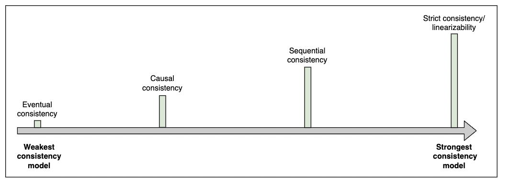

# [WIP] Data Consistency Protocols

- Purpose: Enforce consistency guarantees across distributed data stores to maintain data integrity.
- Function: Ensure data consistency across replicas or partitions in a distributed system.

In distributed systems, consistency may mean many things.
One is that each replica node has the same view of data at a given point in time.
The other is that each read request gets the value of the recent write.
These are not the only definitions of consistency, since there are many forms of consistency.
Normally, consistency models provide us with abstractions to reason about the correctness of a distributed system doing concurrent data reads, writes, and mutations.

If we have to design or build an application in which we need a third-party storage system like S3 or Cassandra, we can look into the consistency guarantees provided by S3 to decide whether to use it or not.

Difference between consistency in ACID properties and consistency in the CAP theorem
- ACID
  - Database rules are at the heart of ACID consistency.
  - If a schema specifies that a value must be unique, a consistent system will ensure that the value is unique throughout all actions.
  - If a foreign key indicates that deleting one row will also delete associated rows, a consistent system ensures that the state cannot contain related rows once the base row has been destroyed.
- CAP theorem
  - CAP consistency guarantees that, in a distributed system, every replica of the same logical value has the same precise value at all times.
  - This is a logical rather than a physical guarantee.
  - Due to the speed of light, replicating numbers throughout a cluster may take some time.
  - By preventing clients from accessing different values at separate nodes, the cluster can nevertheless give a logical picture.

Linearizable services appear to carry out transactions/operations in sequential, real-time order.
They make it easier to create suitable applications on top of them by limiting the number of values that services can return to application processes.

Linearizable services have worse performance rates than services with weaker consistency in exchange for their strong assurances.
Think about a read in a key-value store that returns the value written by a concurrent write.
The read imposes no limits on future reads if the key-value store is weakly consistent.

Application programmers have to compromise performance and availability if they use services with strong consistency models.
The models may break the invariants of applications built on top of them in exchange for increased performance.

According to the CAP Theorem, consistency means that every successful read request will return the result of the most recent write.
This is an oversimplification, because there are many different forms of consistency.
The consistency model is a formal model which defines all these forms.
The consistency model defines the set of execution histories that are valid in a system, where a history is a collection of operations, including their concurrent structure (i.e. the order they are interleaved during execution).
A model formally defines the behaviors that are possible in a distributed system.
Consistency models are useful because
- they help us formalize the behaviors of systems; systems can then provide guarantees about their behavior
- software engineers can confidently use a distributed system (i.e. a distributed database) in a way that does not violate any safety properties they care about
In essence, software engineers can treat a distributed system as a black box that provides a set of properties.
Moreover, they can do this without knowing all of the complexity the system internally assumes to provide these properties.

We consider consistency model A stronger than model B when the first allows fewer histories.
Alternatively, we say model A makes more assumptions about or poses more restrictions on the system’s possible behaviors.
Usually, the stronger the consistency model a system satisfies, the easier it is to build an application on top of it.
This is because the developer can rely on stricter guarantees.

Spectrum of consistency models - consistency guarantees get stronger as we move to the right

# Strict Consistency

- Every read operation must return the value of the most recent write operation.

A strict consistency or linearizability is the strongest consistency model.
This model ensures that a read request from any replicas will get the latest write value.
Once the client receives the acknowledgement that the write operation has been performed, other clients can read that value.

Linearizability is challenging to achieve in a distributed system.
Some of the reasons for such challenges are variable network delays and failures.
The following scenario shows how variable network delays make it possible for different parties to see different values.
- There are three users of a system consisting of three nodes (replicas), and each node initially has a value of x that equals 2
- Alice requests a write operation to change the value of x to 10
- Node A performs the write operation on x and returns an acknowledgement back to Alice
- Node A forwards the write operation to the other nodes in the system
- Node B receives the write operation and changes the value of x to 10
- John requests a read operation that is performed on Node B
- Node B has the latest value of x and returns it to John
- After John, Bob requests a read operation on x, which is performed on Node C
- Node C has not yet received the write operation, so it returns the old value of x = 2 to Bob

Usually, synchronous replication is one of the ingredients for achieving strong consistency, though it in itself is not sufficient.
We might need consensus algorithms such as Paxos and Raft to achieve strong consistency.

Linearizability affects the system’s availability, which is why it is not always used.
Applications with strong consistency requirements use techniques like quorum-based replication to increase the system’s availability.

Example
- Updating an account’s password requires strong consistency.
  - For example, if we suspect suspicious activity on our bank account, we immediately change our password so that no unauthorized users can access our account.
  - If it were possible to access our account using an old password due to a lack of strict consistency, then changing passwords would be a useless security strategy.
- Amazon Aurora provides strong consistency.

A system that supports the consistency model of linearizability is one where operations appear to be instantaneous to the external client.
This means that they happen at a specific point - from the point the client invokes the operation, to the point the client receives the acknowledgement by the system the operation has been completed.
Furthermore, once an operation is complete and the acknowledgement is delivered to the client, it is visible to all other clients.
This implies that if a client C2 invokes a read operation after a client C1 receives the completion of its write operation, C2 should see the result of this (or a subsequent) write operation.
It may be obvious to some that operations are instantaneous and visible after they are completed.
In a centralized system, linearizability is obvious.
The following illustration shows this.
- There is a client and a single node centralized system.
- Client sends a write request to the system for setting value of X equals 10
- System receives the write request, and sets value of X = 10 locally
- System sends an ack message to the client that the write request has been performed.
- Client node sends a read request to the system to read value of X
- Since the system has performed write operation before receiving the read request, it will return the latest value of X which is 10

However, there is no such thing as instantaneity in a distributed system.
The following illustration shows why linearizability is not obvious in a distributed system.
- A client is using a distributed system of three nodes, A, B, and C, which are asynchronous replicas, for each node X is initialized to 0
- Client sends a write request to Node A for updating value of X to 10
- Node A receives the write request, and updates the value of X locally
- Node A sends an ack message to the client that the write request has been performed.
- Node A forwards the write request to Node B and C
- Node B receives the write request, and updates the value of X locally
- Client sends a read request for X to Node C, the Node C has not yet received the write request
- Old value of X (0) is returned to the client because the write operation is not performed yet on Node C
- Node C receives the write request, and updates the value of X locally

[see figure in google docs]

When we think of a distributed system as a single node, it seems obvious that every operation happens at a specific instant of time, and is immediately visible to everyone.
However, when we think of a distributed system as a set of cooperating nodes, we realize that we should not take this for granted.
For instance, the system in the above illustration is not linearizable since T4 > T3.
However, still, the second client will not observe the read because it has not yet propagated to the node that processes the read operation.
The non-linearizability comes from the use of asynchronous replication.
When we use a synchronous replication technique, we make the system linearizable.
However, that means that the first write operation takes longer until the new value has propagated to the rest of the nodes.
Remember the latency-consistency trade-off from the PACELC theorem.

Benefits
- As a result of the above discussion, we realize that linearizability is a very powerful consistency model.
- It helps us treat complex distributed systems as much simpler, single-node datastores, and reason about our applications more efficiently.
- Moreover, by leveraging atomic instructions provided by hardware (such as CAS operations - https://en.wikipedia.org/wiki/Compare-and-swap), we can build more sophisticated logic on top of distributed systems, such as mutexes, semaphores, counters, etc.
- This is not possible under weaker consistency models.

## Linearizability

- Every operation appears to take effect instantaneously at a single point in time between its invocation and response.
- A form of strict consistency.

# Sequential Consistency

The result of any execution is the same as if the operations by all processes were executed in some sequential order.
Operations within a process appear in the order specified by its program.
Operations from different processes may be interleaved in any order.

In sequential consistency, the execution of operations on a distributed system appears as if they were executed in some sequential order that respects the real-time ordering of those operations.
This means that for any two operations, if one operation happens before another according to the real-time order, then all other nodes in the system must agree on that order.
However, operations from different nodes might be interleaved in a way that doesn't reflect the real-time order.

Sequential consistency is more about the order in which operations appear to occur in a distributed system.

Sequential consistency is stronger than the causal consistency model.
It preserves the ordering specified by each client’s program.
However, sequential consistency does not ensure that the writes are visible instantaneously or in the same order as they occurred according to some global clock.

Example
- In social networking applications, we usually do not care about the order in which some of our friends’ posts appear.
- However, we still anticipate a single friend’s posts to appear in the correct order in which they were created.
- Similarly, we expect our friends’ comments in a post to display in the order that they were submitted.
- The sequential consistency model captures all of these qualities.

Sequential consistency is a weaker consistency model, where operations are allowed to take effect before their invocation or after their completion.
As a result, it provides no real-time guarantees.
However, operations from different clients have to be seen in the same order by all other clients, and operations of every single client preserve the order specified by its program (in this global order).
This allows many more histories than linearizability, but still poses some constraints that can help real-life applications.

Example
- For example, in a social networking application, we usually do not care what is the ordering of posts between some of our friends.
- However, we still expect posts from a single friend to be displayed in the right order (i.e. the one they published them at).
- Following the same logic, we usually expect our friends’ comments in a post to appear in the order that they submitted them.
- These are all properties that the sequential consistency model captures.

# Causal Consistency

Preserves causal relationships between operations.
If operation A causally precedes operation B, then B must observe the effect of A.

Causal consistency works by categorizing operations into dependent and independent operations.
Dependent operations are also called causally-related operations.
Causal consistency preserves the order of the causally-related operations.

In the following illustration, process P1 writes a value a at location x.
For P2 to write the value b at location y, it first needs to calculate b.
Since b = x + 5, the read operation on x should be performed before writing b on location y.
That is why read(x)a and write(y)b are causally related.

[see figure in google docs]

This model does not ensure ordering for the operations that are not causally related.
These operations can be seen in different possible orders.

Causal consistency is weaker overall, but stronger than the eventual consistency model.
It is used to prevent non-intuitive behaviors.

Example
- The causal consistency model is used in a commenting system. For example, for the replies to a comment on a Facebook post, we want to display comments after the comment it replies to. This is because there is a cause-and-effect relationship between a comment and its replies.

In some cases, we do not need to preserve the ordering specified by each client’s program - as long as causally related operations are displayed in the right order.
This is the causal consistency model, which requires that only operations that are causally related need to be seen in the same order by all the nodes.

Example
- Consider the same scenario as our previous comments example.
- We may want to display comments out of chronological order if it means that every comment is displayed after the comment it replies to.
- This is expected since there is a cause-and-effect relationship between a comment and the comments that constitute replies to it.
- Thus, unlike in sequential consistency, the operations that are not causally related can be seen in different orders in the various clients of the system, without the need to maintain the order of each client’s program.
- Of course, to achieve that, each operation needs to contain some information that signals whether it depends on other operations or not.
- This does not need to at all be related to time and can be an application-specific property.
- Causal consistency is a weaker consistency model that prevents a common class of unintuitive behaviors.

# Eventual Consistency

Updates to a data item propagate through the system and eventually all replicas converge to the same value.
Guarantees consistency after a certain period of time in absence of further updates.

- Eventual consistency is a weaker consistency model that allows replicas to diverge temporarily but guarantees that they will eventually converge to the same state.
- In eventual consistency replication, updates are propagated asynchronously to replicas, and conflicts are resolved using reconciliation mechanisms.
- While eventual consistency offers high availability and scalability, it may lead to temporary inconsistencies in data.

Eventual consistency is the weakest consistency model.
The applications that do not have strict ordering requirements and do not require reads to return the latest write choose this model.
Eventual consistency ensures that all the replicas will eventually return the same value to the read request, but the returned value is not meant to be the latest value.
However, the value will finally reach its latest state.

Eventual consistency ensures high availability.

Examples
- The domain name system is a highly available system that enables name lookups to a hundred million devices across the Internet. It uses an eventual consistency model and does not necessarily reflect the latest values.
- Cassandra is a highly available NoSQL database that provides eventual consistency.

There are still even simpler applications that do not have the notion of a cause-and-effect and require an ever simpler consistency model.
The eventual consistency model is beneficial here.

Example
- For instance, we could accept that the order of operations can be different between the multiple clients of the system, and reads do not need to return the latest write as long as the system eventually arrives at a stable state.
- In this state, if no more write operations are performed, read operations will return the same result.
- This is the model of eventual consistency.

It is one of the weakest forms of consistency since it does not really provide any guarantees around the perceived order of operations or the final state the system converges to.

It can still be a useful model for some applications, which do not require stronger assumptions or can detect and resolve inconsistencies at the application level.

# Other Consistency Models

- There are many consistency models other than these four, and there is still room for new consistency models.
- Researchers have developed new consistency models.
- For example, [Wyatt Lloyd, et al.](https://www.cs.princeton.edu/~wlloyd/papers/cops-sosp11.pdf), proposed the causal+consistency model to speed up some specific types of transactions.

# Database Consistency Models

## Serializability

- Ensures that the result of executing transactions serially is the same as executing them concurrently.
- Transactions appear to be executed one after another without interleaving.
- More focused on database transactions rather than distributed systems.
- These models represent a spectrum ranging from strong consistency, where every operation must behave as if it were the only operation in the system, to weak consistency, where the system allows for more flexibility and eventual convergence over time.

Serializability is a property of a schedule of transactions in a database system.
A schedule is serializable if it's equivalent to some serial execution of transactions, meaning that the result of executing the transactions in parallel is the same as executing them one after the other in some order.
Serializability ensures that the execution of transactions doesn't violate the consistency constraints of the database.

Serializability is about ensuring that the execution of transactions in a database maintains consistency. They both aim to ensure consistency but at different levels and in different contexts.
